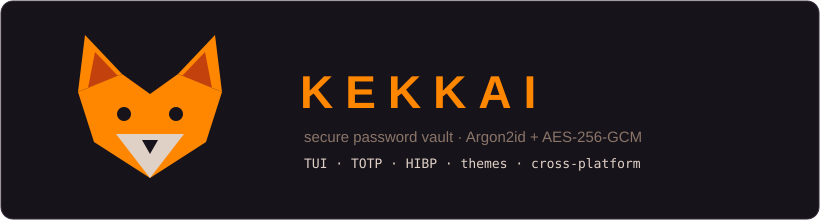
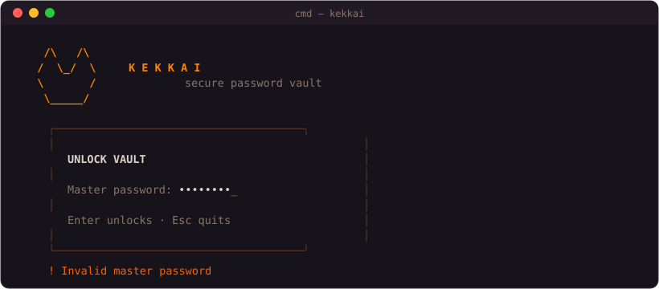
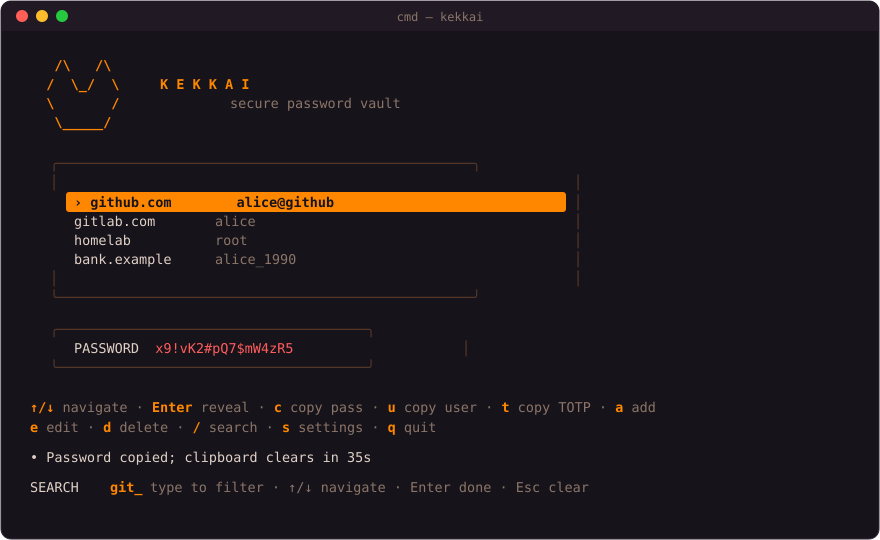
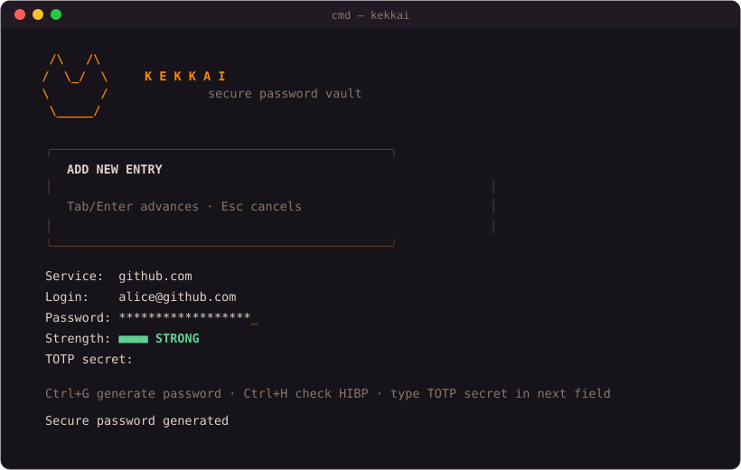
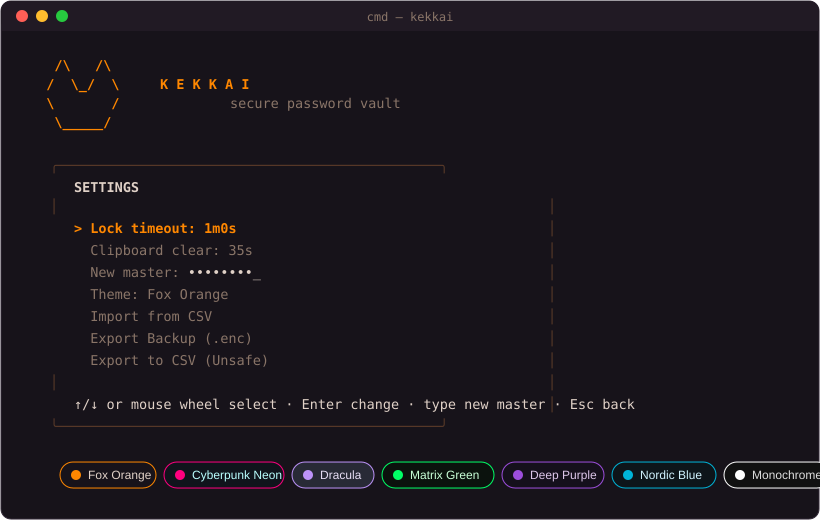

<p align="center">
  
</p>

<h1 align="center">kekkai 🦊</h1>

<p align="center">
  <strong>Минималистичный клавиатурный менеджер паролей, живущий в терминале.</strong><br/>
  Argon2id · AES-256-GCM · интерактивный TUI · TOTP · без внешних CLI-фреймворков
</p>

<p align="center">
  <a href="#-возможности"></a>
  
  
  
  <a href="LICENSE"></a>
</p>

<p align="center"><a href="README.md">🇬🇧 English version</a></p>

---

## ✨ Возможности

- **Интерактивный TUI** — список записей, формы, fuzzy-поиск, прокрутка колесом мыши, 7 цветовых тем
- **Надёжное шифрование** — выведение ключа Argon2id (t=3, m=64 МиБ, p=4) + аутентифицированное шифрование AES-256-GCM
- **Встроенный TOTP** — храните секрет записи и получайте коды 2FA одним нажатием
- **Проверка на утечки** — сверка пароля с Have I Been Pwned по k-anonymity (сам пароль не покидает машину)
- **Генератор паролей** — `Ctrl+G` подставляет стойкий 18-символьный пароль прямо в поле
- **Гигиена буфера обмена** — скопированные секреты стираются через 15/35/60 секунд (настраивается)
- **Автоблокировка** — хранилище блокируется после простоя и очищает записи из памяти
- **Хоткеи независимо от раскладки** — работают одинаково в английской и русской раскладках (`s` = `ы`, `a` = `ф`…)
- **Безопасное хранение** — атомарная запись (временный файл + rename, права 0600), секреты затираются в памяти
- **Переносимость** — один бинарник, без демонов и облаков; хранилище — один зашифрованный файл

## 📸 Скриншоты

| Разблокировка | Хранилище |
| --- | --- |
|  |  |

| Добавление записи | Настройки и темы |
| --- | --- |
|  |  |

## 🚀 Установка

**Windows (PowerShell):**

```powershell
irm https://raw.githubusercontent.com/Dtierofficial/kekkai-cli/main/scripts/install.ps1 | iex
```

**Linux / macOS:**

```sh
curl -fsSL https://raw.githubusercontent.com/Dtierofficial/kekkai-cli/main/scripts/install.sh | sh
```

**Из исходников** (Go 1.22+):

```sh
go install github.com/Dtierofficial/kekkai-cli/cmd/kekkai@latest
```

> Windows: добавьте `%USERPROFILE%\go\bin` в `PATH`. Linux/macOS: `$HOME/go/bin`.

## ⌨️ Быстрый старт

```text
kekkai init     # создать хранилище (запросит мастер-пароль)
kekkai          # открыть интерактивный интерфейс
```

Классические команды CLI также доступны:

```text
kekkai add github.com alice
kekkai get github.com
kekkai list
kekkai delete github.com
kekkai import passwords.csv
```

> `kekkai delete <service>` удаляет **все** записи этого сервиса (все логины). В TUI клавиша `d` удаляет только выбранную запись.
>
> `kekkai import` запрашивает мастер-пароль (скрытый ввод), показывает список добавляемых записей — только сервисы и логины, без паролей — и требует явного подтверждения перед записью. Дубли (тот же сервис + логин) пропускаются. Принимает экспорты kekkai и CSV форматов Bitwarden/Chrome.

## 🖥️ Горячие клавиши

### Список записей

| Клавиша | Действие |
| --- | --- |
| `↑` / `↓` | навигация (работает и колесо мыши) |
| `Enter` | показать / скрыть пароль |
| `c` | скопировать пароль |
| `u` | скопировать логин |
| `t` | сгенерировать и скопировать код TOTP |
| `a` | добавить запись |
| `e` | редактировать запись |
| `d` | удалить запись |
| `/` | fuzzy-поиск / фильтр |
| `s` | настройки |
| `Esc` | сбросить фильтр → выход |
| `q` / `Ctrl+C` | выход |

Хоткеи **не зависят от раскладки**: в русской раскладке нажимайте те же физические клавиши (`ы` работает как `s`, `ф` как `a`, …). Работают Shift и CapsLock.

### Форма добавления / редактирования

| Клавиша | Действие |
| --- | --- |
| `Tab` / `Enter` | следующее поле |
| `Backspace` | удалить символ |
| `Ctrl+G` | сгенерировать стойкий пароль в поле |
| `Ctrl+H` | проверить пароль через HIBP |
| `Esc` | отмена |

### Подтверждения и вход

| Клавиша | Действие |
| --- | --- |
| `y` / `Enter` | подтвердить удаление / экспорт |
| `n` / `Esc` | отмена |
| `Enter` (экран входа) | разблокировать хранилище |
| `Esc` (экран входа) | выход |

## ⚙️ Настройки

Открываются клавишей `s`. Навигация `↑`/`↓`, изменение — `Enter`:

| Пункт | Значения |
| --- | --- |
| Lock timeout | Off · 1m · 5m · 15m (по умолчанию 5m) |
| Clipboard clear | 15s · 35s · 60s |
| New master | введите новый мастер-пароль и нажмите `Enter` |
| Theme | Fox Orange · Cyberpunk Neon · Dracula · Matrix Green · Deep Purple · Nordic Blue · Monochrome |
| Import from CSV | объединение записей из CSV: собственных экспортов kekkai (`service`) или файлов Bitwarden/Chrome (`url`/`name`, `username`, `password`, опционально `totp`) |
| Export Backup (.enc) | зашифрованная переносимая резервная копия |
| Export to CSV (Unsafe) | экспорт открытым текстом — используйте осторожно |

## 🔐 Модель безопасности

- Мастер-пароль → **Argon2id** (time=3, memory=64 МиБ, threads=4) → 256-битный ключ
- Тело хранилища шифруется **AES-256-GCM** (12-байтовый nonce, случайный при каждой записи)
- Формат файла: магия `KKV1` + версия + соль + nonce + шифротекст; поддержана версионность формата
- Запись **атомарная**: временный файл (0600) + rename — сбой не портит хранилище
- Открытые секреты **затираются в памяти**, как только становятся ненужными
- Без телеметрии; единственный сетевой вызов — необязательная проверка HIBP (k-anonymity: уходит только 5-символьный префикс SHA-1)
- Скопированные секреты стираются из буфера по таймеру — если выйти из приложения раньше, последний секрет останется в буфере обмена
- TOTP-секреты хранятся в том же зашифрованном теле хранилища, что и пароли — отдельного ключа шифрования для каждого поля нет

⚠️ **Восстановления нет.** Потеряли мастер-пароль — потеряли хранилище. Без него файл нечитаем.

## 📁 Расположение файлов

| Что | Windows | Linux / macOS |
| --- | --- | --- |
| Хранилище | `%AppData%\kekkai\vault.kek` | `$XDG_CONFIG_HOME/kekkai/vault.kek` или `~/.config/kekkai/vault.kek` |
| Конфиг (тема) | `%AppData%\kekkai\config.json` | тот же шаблон |

## 🛠️ Сборка из исходников

```sh
git clone https://github.com/Dtierofficial/kekkai-cli.git
cd kekkai-cli
go build -o kekkai ./cmd/kekkai
go test ./...
```

```
kekkai-cli/
├── cmd/kekkai/    # TUI, команды CLI, настройка консоли
├── vault/         # шифрование, формат хранения, атомарный ввод-вывод
└── scripts/       # install.ps1 / install.sh
```

---

<p align="center">Сделано на Go с лисой. Держите ключи в норе. 🦊</p>
